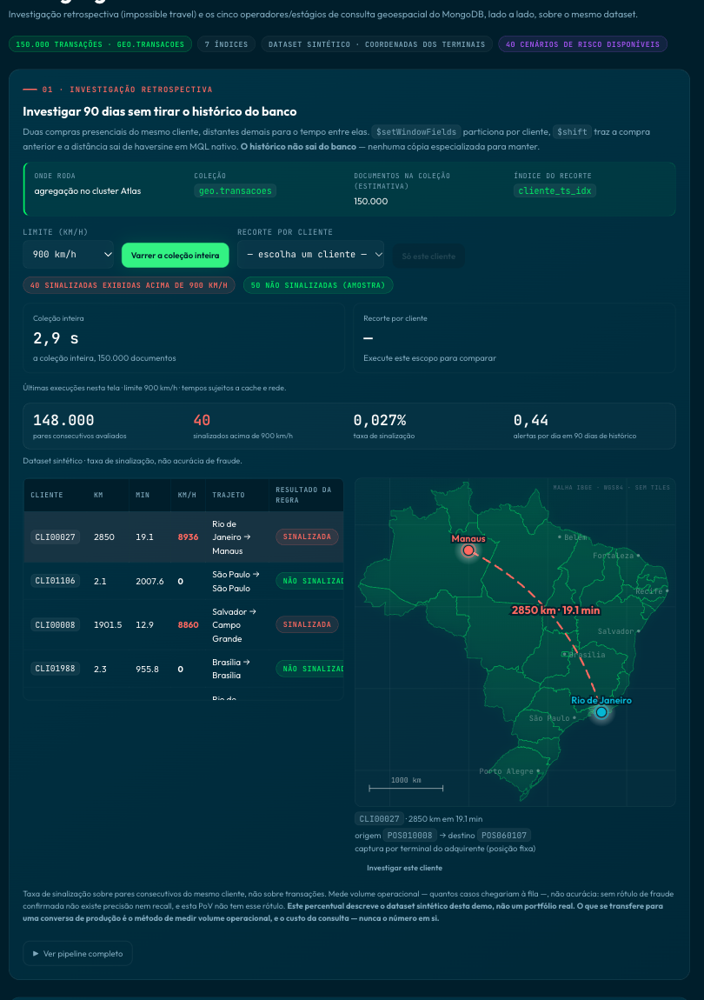
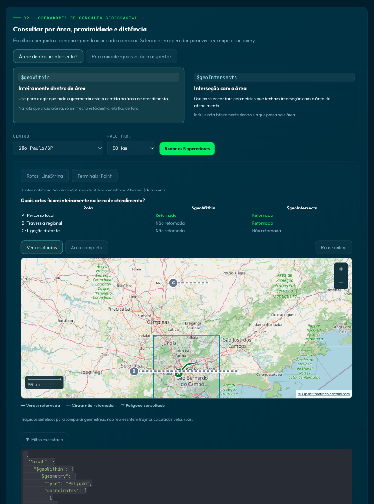

# MongoDB Atlas geo showcase

An interactive PoV that proves real geospatial behavior in MongoDB Atlas against a real cluster, with no fraud-detection storytelling and no map for its own sake. Two panels:

1. **Retrospective investigation** (`impossible-travel`): pairs of card-present purchases by the same customer that are too far apart for the time between them. `$setWindowFields` partitions by customer, `$shift` brings in the previous purchase, and the distance comes from a haversine computed in plain MQL operators, inside the cluster.
2. **Geospatial query operators** (`operadores`): MongoDB's five geospatial operators/stages side by side over the same geometry: `$geoWithin`, `$geoIntersects`, `$near`, `$nearSphere`, and `$geoNear`.

This repository was extracted from the geo module (08) of [`mongodb-atlas-feature-showcase`](https://github.com/adrianofratelli-glitch/mongodb-atlas-feature-showcase) as a standalone PoV. React 18 + Vite frontend, FastAPI + PyMongo backend, MongoDB Atlas as the data layer. No LLM.

UI text, docstrings, and error messages are in Brazilian Portuguese by design (Brazilian audience); this README and the code structure are in English.

## What you see

**1. Investigate 90 days without taking the history out of the database.** One aggregation over 150,000 synthetic transactions scans the whole collection, flags consecutive purchase pairs above a speed limit, and plots the selected case. Here: Rio de Janeiro → Manaus, 2,850 km in 19.1 minutes (8,936 km/h), one of 40 flagged pairs out of 148,000 evaluated.



**2. Area: within or intersects?** The same three routes and the same service area, asked two ways. `$geoWithin` requires the whole geometry inside the polygon; `$geoIntersects` also returns the route that merely crosses it. The table, the map, and the executed filter come from the same Atlas query.



**3. Proximity: which are closest?** `$near`, `$nearSphere`, and `$geoNear` over the same terminals around São Paulo. `$geoNear` runs in the aggregation pipeline and returns the distance in meters.


## What this proves, and what it does not

- **Proves:** real geospatial predicates (`$geoWithin`, `$geoIntersects`, `$near`, `$nearSphere`, `$geoNear`) running on the cluster with a `2dsphere` index (confirmed via `explain()`: IXSCAN, not COLLSCAN), and a distance calculation (haversine) done entirely in MQL, without pulling data into the application.
- **Does not prove:** it is not a fraud engine, it has no confirmed-fraud label (so no precision/recall can be computed), and it does no geometry algebra (no buffer/union/intersection/area; WGS84 only, no raster or topology). `$geoNear` must be the first stage of the pipeline; the `filter` of `$vectorSearch` rejects geospatial operators.

## Commands

```bash
# Backend
cd backend
python3 -m venv venv && source venv/bin/activate
pip install -r requirements-dev.txt
cp .env.example .env   # fill in MONGO_URI
uvicorn main:app --reload --port 8010

# Dataset (repo root, backend venv active)
python scripts/seed_geo.py            # 150k geo-referenced transactions in geo.transacoes
python scripts/seed_geo.py --drop     # recreate from scratch
python scripts/seed_geo.py --ensure   # idempotent path
./scripts/create_search_index_geo.sh  # Atlas Search index (search panel, see docs/setup-geo.md)

# Frontend
cd frontend
npm install
cp .env.example .env
npm run dev            # :5184, proxy /api -> :8010
```

Tests and lint (repo root):

```bash
pytest                          # backend/tests, stubbed Mongo, no live cluster
ruff check backend
cd frontend && node --test tests/*.test.mjs
```

Before any demo: `curl http://localhost:8010/preflight`.

## Environment

Copy `backend/.env.example` to `backend/.env`:

- `MONGO_URI`, `MONGO_DB` (default `POC`), `MONGO_TIMEOUT_MS`.
- `GEO_DB` (default `geo`), `GEO_SEARCH_INDEX` (default `idx_geo_estabelecimento`).
- `DEMO_ADMIN_TOKEN`: only needed to allow mutations from anything other than loopback (this PoV exposes no destructive mutations, but the guard is the same as in the rest of the portfolio); mirror it as `VITE_DEMO_API_TOKEN` in the frontend.
- `ALLOWED_ORIGINS` (default `http://localhost:5184,http://127.0.0.1:5184`).

## Dataset

`scripts/seed_geo.py` generates 150,000 card-present transactions, Gaussian clusters around 40 real municipalities. The location is the registered coordinate of the acquirer terminal (`TERMINAL_ADQUIRENTE`, `CADASTRAL`): a terminal keeps a stable identity, merchant, and coordinate. Impossible travel is a risk signal, never a fraud decision. Idempotent through a fixed RNG seed plus a unique index on `endToEndId`.

Planted impossible-travel pairs derive the interval from a target speed (1,100–9,000 km/h), never the other way around: drawing minutes directly gave 16,000–42,000 km/h, twenty times any real cloned-card pattern. The dataset randomizes the pair's position in the customer's sequence, so cases spread across the 90 days instead of clustering at the start.

`backend/data/fraud_seeds.json` stores the customer IDs whose pairs were planted, so the demo has a guaranteed result on stage; regenerated by the seed.

## Technical pitfalls

- **`$geoNear` refuses to run when the geo field has more than one 2dsphere index, and no hint resolves it.** Tested three ways (hint on `aggregate()`, `key` inside the stage, raw hint through `db.command`), all refused with `code 27 IndexNotFound`. `geo.transacoes` has two on purpose (the pure `local_2dsphere_idx` and the compound `cliente_status_local_idx` used by the explain panel). Resolved with `geo.transacoes_geonear`, a `$out` copy maintained by `scripts/seed_geo.py` itself (on both paths, `--ensure` and full generation) with a single index, without rewriting the generator.
- **Circle vs. square finding:** a circle (`$near`/`$nearSphere`/`$geoNear`, via spherical `$maxDistance`) and a square (`$geoWithin`/`$geoIntersects`, via a `$geometry` Polygon) over the same radius return different counts by design, since a circle inscribed in the square covers less area. Tested on 2M documents (2,000 km radius): 128,364 (square) vs 119,152 (circle), consistent with the geometry, not a bug.
- **`$near`/`$nearSphere` are `find()` operators:** they do not work inside an aggregation `$match`, so they have no `count_documents`. This is a real MongoDB restriction, not a limit of this demo. `$geoNear` solves it: it is the aggregation path, with a mandatory first stage.
- The square around center+radius clamps coordinates near the pole/antimeridian; without the clamp, `$geoWithin` returns `BadValue` for latitude outside `[-90,90]`.
- The investigation panel runs a `$facet` with two branches over the same `$setWindowFields` (the expensive part, computed once): `sinais` (above the limit) and `aprovados` (a `$sample` within the limit). The final list interleaves the two classes instead of sorting only by `ts`, because the approved sample tends to concentrate recent dates and pushed every flagged pair to the end of the table. Selectivity (pairs evaluated / flagged / rate / alerts per day) is counted **before** the geometric cut.
- The map (`frontend/src/components/MapaBrasil.jsx`) uses the IBGE state mesh (`frontend/src/data/brasil-uf.js`, 27 states, ~41 KB), simplified with Douglas-Peucker at 0.05° over coordinates quantized to a 0.02° grid; the quantization is what prevents gaps between neighboring states. Equirectangular projection with a `cos(-15°)` factor: without it the South comes out ~18% too wide. No Leaflet/Mapbox/tiles and no external map dependency, so the module renders and stays functional with the external network blocked. The only external request is Google Fonts in `frontend/index.html`. (The street-level maps in the operators panel use OpenStreetMap tiles and are optional.)
- The text-relevance search panel (`POST /geo/search`, `GET /geo/explain-compare`) is still implemented and tested, but outside the default visible flow of the frontend (only the two panels above are on screen); available through the API for anyone who wants to explore `$search` + facets.

## Security

`MutationGuardMiddleware` blocks mutations from outside loopback unless `DEMO_ADMIN_TOKEN` matches through `hmac.compare_digest`; `ApiHardeningMiddleware` applies a body-size ceiling and `nosniff`/`DENY`/`no-referrer`/`no-store` headers. This PoV exposes no destructive endpoints (no index creation/deletion, no `collMod`); both modules are read-only over `geo.transacoes`.

Never point this at anything other than a disposable demo cluster, and keep credentials out of version control (`backend/.env` is in `.gitignore`).
